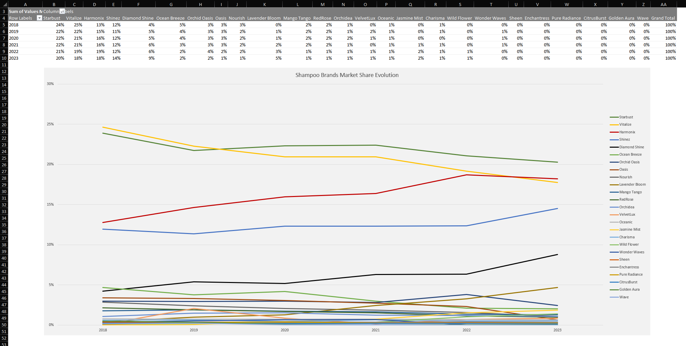
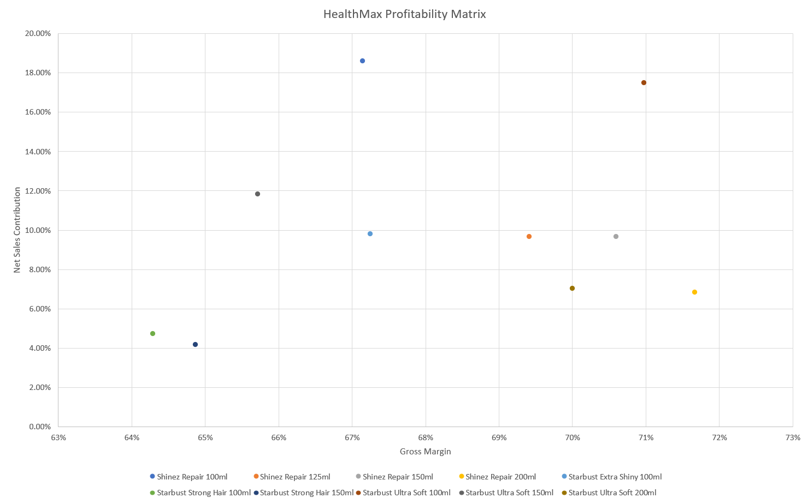
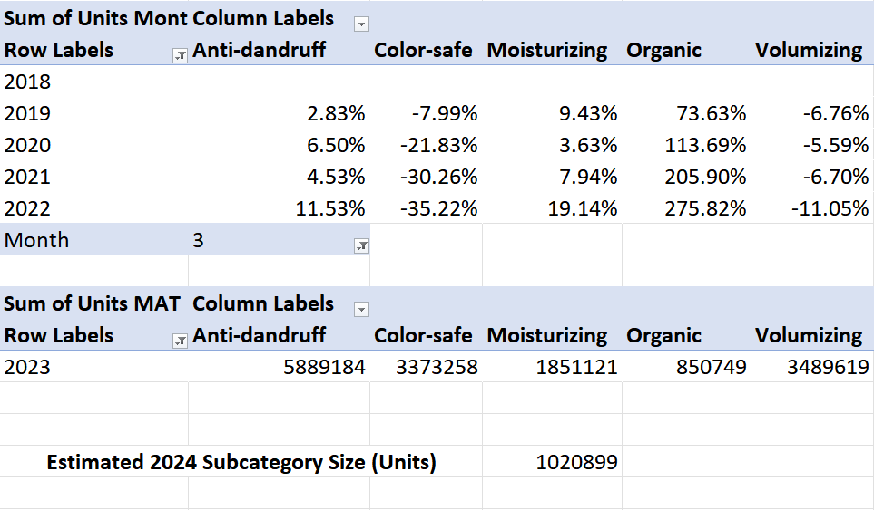
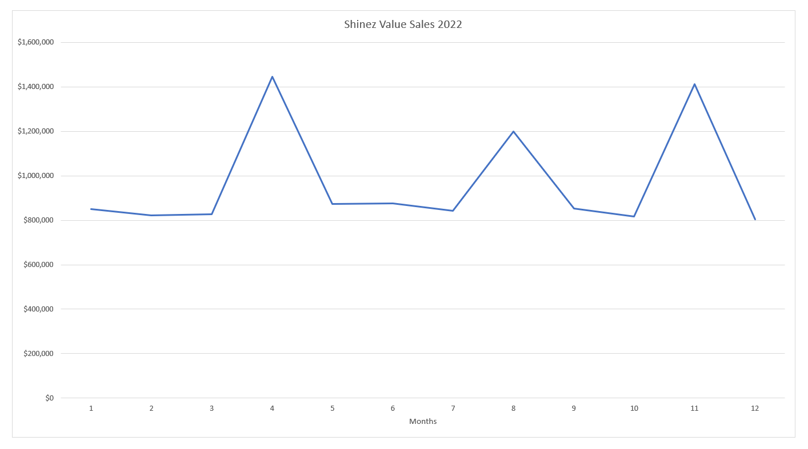
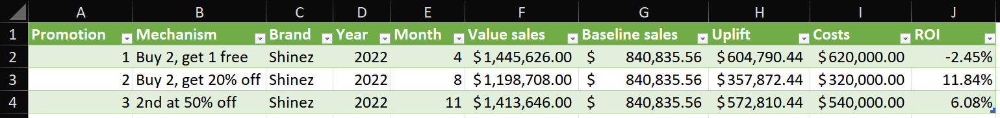
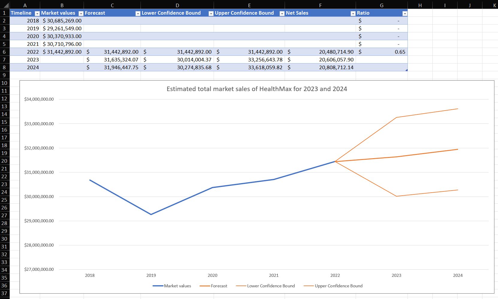
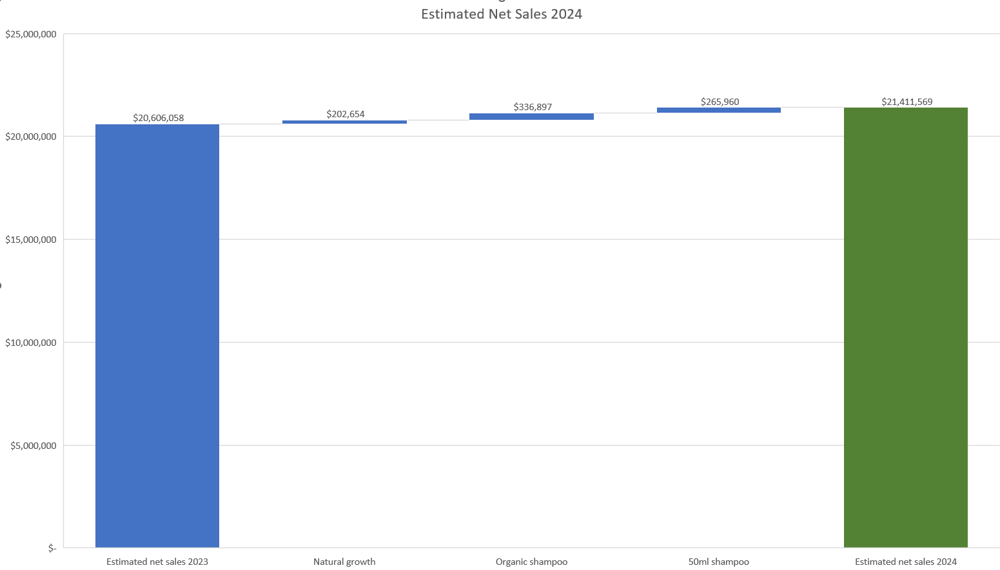

# FMCG Net Revenue Management (NRM) & Strategic Forecasting

*(Scroll down for the Polish version / Wersja polska poniżej)*

##  Project Overview
This project is a comprehensive **Net Revenue Management (NRM)** analysis conducted for HealthMax, an FMCG company in the shampoo category. The objective was to transform raw sales and market data into a strategic growth plan for 2024. The analysis is built upon the pillars of NRM, combining advanced Excel modeling with strategic business thinking to optimize margins and identify new market opportunities.

##  Tech Stack & Skills

 **Tool:** Microsoft Excel (Advanced) 
 **Data Manipulation:** Pivot Tables, `XLOOKUP`, `SUMIFS` (Dynamic Criteria) 
 **Time Intelligence:** MAT (Moving Annual Total), YTD (Year-to-Date), YoY Growth 
 **Forecasting:** ETS Algorithm (Exponential Triple Smoothing), Confidence Intervals 
 **Visualization:** Waterfall Charts (Strategic Bridge), Scatter Plots (Portfolio Matrix)  

##  Market Performance Audit
I conducted a baseline audit of HealthMax, which operates with 2 brands (Shinez, Starbust) in 2 out of 5 subcategories (Anti-dandruff, Volumizing). 
* **Competitor Threat:** I demonstrated that Starbust's market share dropped from 24% to 21% **(-3 p.p.)** between 2018 and 2022, while the main competitor (Harmonix) grew from 13% to 19% **(+6 p.p.)**. This indicates a direct loss of customers to the key competitor.
* **Growth Engine:** I identified that the Shinez brand maintains a steady growth trend, increasing from 12% to 14% **(+2 p.p.)** by March 2023.
* **Benchmarking:** I pinpointed 2020 as the year with the highest YoY Growth **(+7.22% for Shinez)**, establishing a historical benchmark for maximum brand potential.

## The 5 Pillars of NRM: Implementation

### 1. Brand Portfolio Pricing & Mix Management
I performed a profitability audit of the HealthMax product portfolio:
* **Profitability Matrix:** I engineered a Scatter Plot comparing *Gross Margin %* with *Net Sales Contribution*.  

* **Insights:** I classified the portfolio into actionable segments:
  * **Stars (Profit Drivers):** High sales contribution and high margin.
  * **Volume Drivers:** Massive sales contribution but low margin (crucial for market share, but require cost control).
  * **Niche Margin Generators:** Low sales contribution but highly profitable per unit.
  * **Dogs (Problematic Products):** Low sales and low margin – recommended for immediate delisting.
* **Category Expansion:** I identified a portfolio gap (HealthMax is active in only 2 of 5 subcategories). I proved that the **Organic** category is the fastest-growing segment and estimated its 2024 market demand at **1,020,899 units**.

### 2. Pack Price Architecture (PPA)
I identified a critical gap in the packaging architecture:
* **Opportunity:** The lack of a "Travel Size" (50ml) format. I calculated that launching this specific format will generate an estimated additional Net Sales of **$265,960** annually, driven by a higher price-per-ml premium.

### 3. Promotion Management (ROI Analysis)

I evaluated the historical effectiveness of promotional campaigns for the Shinez brand:
* **Methodology:** I established Baseline Sales (average of non-promoted months) to isolate the true sales Uplift.
* **Insights:** I proved that the "Buy 2, get 1 free" promotion generated a negative return **(ROI: -2.45%)** despite driving the highest sales volume, indicating excessive promotional costs.
* **Recommendation:** I recommended shifting the budget to the "Buy 2, get 20% off" mechanism, which generated the highest uplift and a highly profitable **ROI of +11.84%**.

### 4. Trade Terms Management
By analyzing the pricing structure, I identified the level of Trade Spend (investments in sales channels) by comparing Retail Prices with Net Prices. 
* **Insights:** I demonstrated that the negative ROI of the "Buy 2, get 1 free" promotion is a direct indicator of poorly negotiated trade terms (the retailer profited while the manufacturer subsidized the sale). Regional market share analysis further highlighted areas where trade investments fail to deliver expected returns.

## Forecasting & Strategic Bridge
* **Organic Baseline:** I utilized the **ETS algorithm** and historical data up to 2022 to forecast the market trend. The projected organic Net Sales for 2024 (without NRM initiatives) stands at **$20,808,712**.  

* **NRM Impact:** I built a **Waterfall Chart** which clearly proves that the estimated 2024 Net Sales target of **$21.4M** is primarily driven by active NRM initiatives (Organic launch & 50ml PPA), generating approx. **+$600k** above the natural market trend.

---
*Based on the Case Study: Net Revenue Management in Excel by datacamp.com*  
*Data source: Net Revenue Management in Excel by datacamp.com*  

 

---

## 🇵🇱 POLISH VERSION

##  Opis Projektu
Ten projekt to kompleksowa analiza **Net Revenue Management (NRM)** przeprowadzona dla firmy HealthMax z branży FMCG (kategoria szamponów). Celem było przekształcenie surowych danych sprzedażowych i rynkowych w strategiczny plan wzrostu na rok 2024. Analiza opiera się na filarach NRM, łącząc zaawansowane modelowanie w Excelu z myśleniem strategicznym, aby zoptymalizować marżę i zidentyfikować nowe okazje rynkowe.

##  Audyt Wydajności Rynkowej (Market Performance)
Przeprowadziłem diagnozę firmy HealthMax, która posiada 2 marki (Shinez, Starbust) i działa w 2 z 5 podkategorii. 
* **Zagrożenie ze strony konkurencji:** Wykazałem, że udział w rynku marki Starbust spadł z 24% do 21% **(-3 p.p.)** w latach 2018-2022, podczas gdy główny konkurent (Harmonix) urósł z 13% do 19% **(+6 p.p.)**. Wskazuje to na bezpośrednią utratę klientów na rzecz kluczowego rywala.
* **Motor wzrostu:** Zauważyłem, że marka Shinez utrzymuje stabilny trend, rosnąc z 12% do 14% **(+2 p.p.)** do marca 2023 roku.
* **Benchmarking:** Zidentyfikowałem rok 2020 jako okres najwyższego wzrostu **(+7.22% YoY dla Shinez)**, co stanowi historyczną podstawę do szacowania maksymalnego potencjału marek.

##  Filary NRM: Wdrożenie i Wnioski

### 1. Brand Portfolio Pricing & Mix Management
Przeprowadziłem audyt rentowności portfela produktów HealthMax:
* **Profitability Matrix:** Stworzyłem wykres punktowy zestawiający *Gross Margin %* z *Net Sales Contribution*.
* **Wnioski:** Sklasyfikowałem produkty na 4 strategiczne grupy:
  * **Gwiazdy (Profit Drivers):** Produkty o wysokim udziale w sprzedaży i wysokiej marży (finansują firmę).
  * **Budowniczowie skali (Volume Drivers):** Ogromny udział w sprzedaży, ale niska marża (wymagają kontroli kosztów).
  * **Niszowi generatorzy marży:** Mały udział, ale bardzo wysoka rentowność jednostkowa.
  * **Produkty problematyczne:** Niski udział i niska marża – zarekomendowałem ich usunięcie z oferty.
* **Ekspansja:** Zidentyfikowałem lukę w portfelu (obecność tylko w 2 z 5 podkategorii). Udowodniłem, że kategoria **Organic** rośnie najszybciej i wyliczyłem jej szacowane zapotrzebowanie na rok 2024 na poziomie **1,020,899 sztuk**.

### 2. Pack Price Architecture (PPA)
Zidentyfikowałem lukę w architekturze opakowań:
* **Okazja biznesowa:** Brak formatu "Travel Size" (50ml). Obliczyłem, że jego wdrożenie wygeneruje dodatkowe przychody netto (Net Sales) w wysokości **$265,960** rocznie, dzięki wyższej marży za mililitr.

### 3. Promotion Management (Analiza ROI)
Oceniłem efektywność historycznych akcji promocyjnych marki Shinez:
* **Metodologia:** Wyznaczyłem linię bazową sprzedaży (średnia z miesięcy bez promocji), aby wyizolować realny *Uplift*.
* **Wnioski:** Udowodniłem, że promocja "Buy 2, get 1 free" wygenerowała ujemny zwrot **(ROI: -2.45%)** pomimo najwyższego wolumenu sprzedaży, co oznacza straty operacyjne.
* **Rekomendacja:** Zarekomendowałem przesunięcie budżetu na mechanizm "Buy 2, get 20% off", który wygenerował najwyższy *Uplift* i zyskowny **ROI na poziomie +11.84%**.

### 4. Trade Terms Management
Analizując strukturę cenową, zidentyfikowałem poziom inwestycji w kanały sprzedaży (*Trade Spend*) poprzez zestawienie cen detalicznych z cenami netto. 
* **Wnioski:** Wykazałem, że ujemny ROI promocji to bezpośredni dowód na źle wynegocjowane warunki handlowe (sklep zarabiał, a producent dopłacał). Dodatkowo, podział na regiony w analizie *Market Share* pozwolił zidentyfikować rynki, gdzie inwestycje handlowe nie przynoszą oczekiwanych rezultatów.

##  Prognozowanie i Strategic Bridge (Waterfall)
* **Prognoza organiczna:** Wykorzystałem algorytm **ETS** do prognozy trendu rynkowego. Prognozowany *Net Sales* na rok 2024 (bez inicjatyw NRM) wynosi **$20,808,712**.
* **Wpływ NRM:** Za pomocą wykresu **Waterfall** udowodniłem, że szacowany cel sprzedażowy na 2024 rok (**$21.4M**) zostanie osiągnięty głównie dzięki aktywnym działaniom NRM (nowy produkt Organic i format 50ml), które wygenerują ok. **+$600k** ponad naturalny trend rynkowy.
